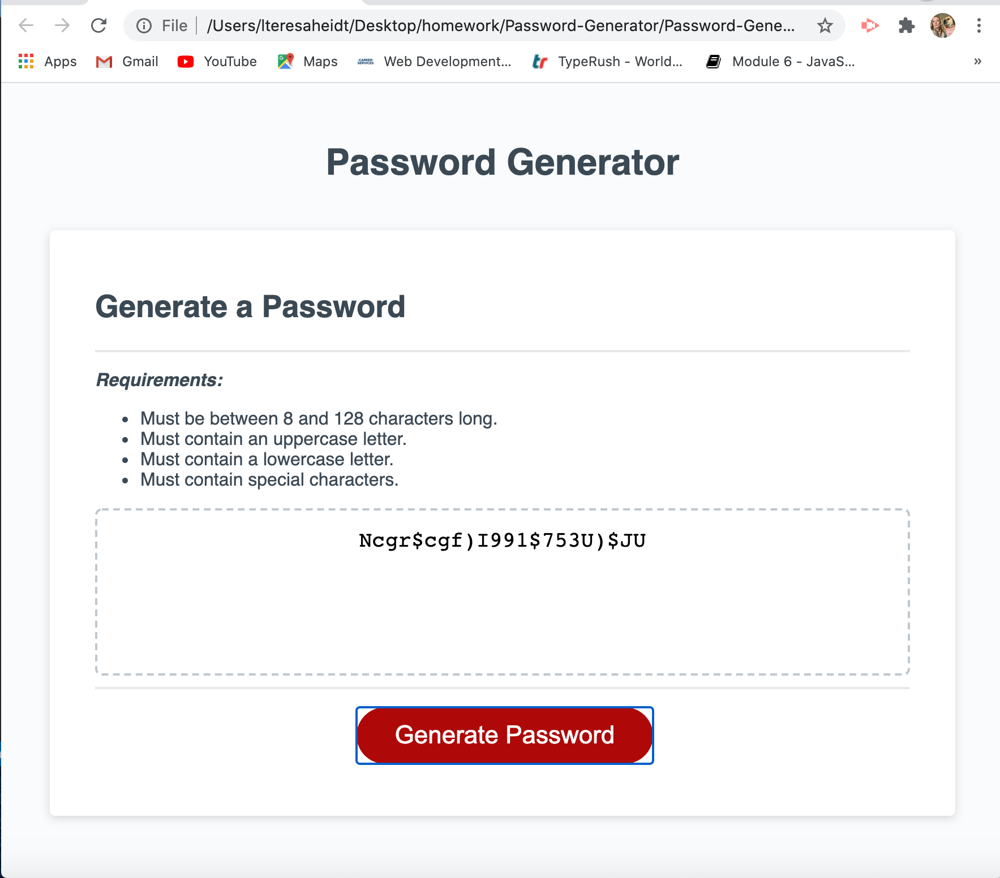

# Password-Generator
<!-- TOC -->

- [Password-Generator](#password-generator)
- [What it is](#what-it-is)
- [The Goal](#the-goal)
- [The steps](#the-steps)
- [What programs were used to make the password generator](#what-programs-were-used-to-make-the-password-generator)
- [How was the application made](#how-was-the-application-made)
- [What the password generator looks like](#what-the-password-generator-looks-like)
- [Result](#result)

<!-- /TOC -->

# What it is
The password generator generates a password based on the user criteria.

# The Goal
My goal was to create a secure and user friendly password generator, that contains numbers, uppercase letters, lowercase letters and special characters.

# The steps
**The Steps to securing the Password:**

* The user will click the user button to generate the password.

* Then a prompt will apear asking the user how many characters they would like.

* The user must type in any number between 8 and 128 characters in length. 

*NOTE: When the user types in a number outside of the given range, a prompt will appear telling the user to use 'More numbers please!' or 'Less numbers please!'* 

* When the number is input, within the given range, the prompt box will appear asking if the user would like to use an uppercase letter.

* The next prompt will be if the user would like to use a lowercase letter.

* The final prompt is asking if the user would like to use a special character.

**If all of these prompts are met, a generated password will appear in the box**

# What programs were used to make the password generator

An html file provided the content for the application. I did adjust the html to provide the user with the criteria with which they would need to generate the password. A css file was used for color and polished content. The Javascript file provided dynamic content to the application.

# How was the application made

A set of arrays were created, listing the character types. 
In order to generate the password, I created a getPasswordOptions function and specified the length, the questions for the user and I then confirmed the values. I specified the password options and created a writePassword function.

# What the password generator looks like

# Result

The application runs in the browser and is super easy to use.
